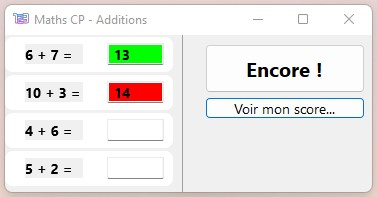

# Xojo-Additions
Petit jeu pour enfant permettant de lui faire réaliser des additions simples // Xojo 2017+ requis

Fonctionnalites :
- Jeu permettant de realiser des additions simples
- Compatible MacOs et Windows
- Sauvegarde du Prenom de l'enfant et du nombre d'additions
- Fonctionne avec l'aide vocale de Windows et de MacOs

Historique des versions :

v0.1 du 17/10/2020

Si vous aimez mes programmes, <a href="https://www.paypal.com/donate/?hosted_button_id=GY5LTDDPZ2HZG"> vous pouvez faire un don PayPal ;)</a>
